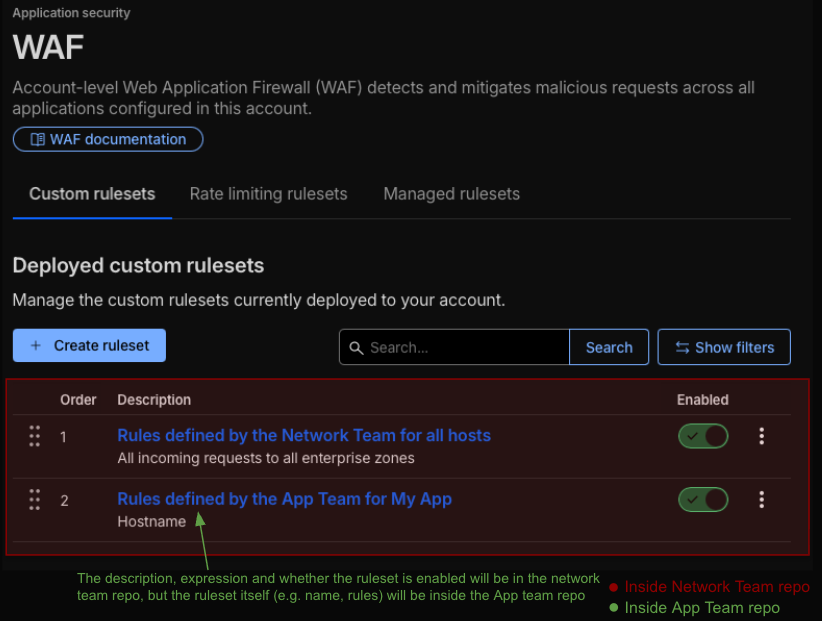
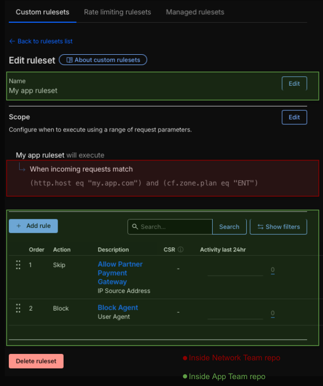
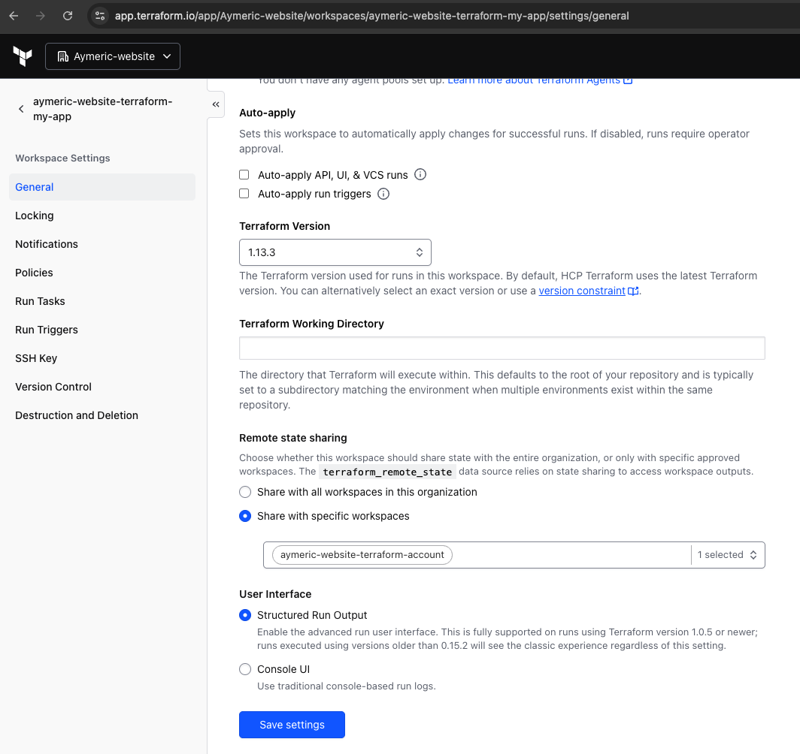

# remote-state-example

## Purpose 
This repository demonstrates the use of the `terraform_remote_state` data source to enable cross-team collaboration in a Terraform-managed infrastructure. It outlines a strategy where multiple teams, each owning a separate repository and state file, can securely share and reference resources defined in those states. 
This pattern can be used to facilitate cross-team collaboration, and should be used with a remote state backend.

## 🛠️ Prerequisites / Tools Used

* **Terraform Backend:** Terraform Cloud (or equivalent remote backend supporting `remote` data source access).
* **Cloudflare Provider:** V5


## Goal
The objective of this solution is to establish a secure and collaborative workflow that allows multiple teams to contribute to a shared infrastructure, specifically by enabling **decoupled ruleset management** in Cloudflare WAF.

### 🌐 Scenario: Network and Application Team Separation

The goal is to allow teams to work in isolation while maintaining a unified security posture.

| Role                    | Team             | Responsibility                                                                                                                                 | Terraform Role               |
| :---------------------- | :--------------- | :--------------------------------------------------------------------------------------------------------------------------------------------- | :--------------------------- |
| **Global Orchestrator** | **Network Team** | Manages global infrastructure and the **Root Ruleset**. Enforces base security and routes traffic to specific app rulesets based on hostnames. | **Consumer** (Reads state)   |
| **App Owner**           | **App Team**     | Manages application-specific security logic (e.g., payment gateways, user-agent blocking). Creates a **Custom Ruleset**.                       | **Producer** (Outputs state) |


---

### Result

As you can see in the screenshot above, once everything is implemented and tf files are applied, we will have 2 rulesets in the WAF account: One ruleset managed by the Network team, and one ruleset managed by the app team. You can see the network team repo as being a consumer of the ruleset defined in the App Team repo.


The screenshot shows the ruleset defined by the App team. It is the second item in the list showed in the first screenshot. The rules are managed by the app team, whilst the expression (e.g. hostname = my.app.come) is managed by the Network team, allowing the App team to work in isolation and preventing them from interfering with other hosts and application.

## 🚀 Step-by-Step Implementation

### Phase 1: App Team
#### 1. Create a ruleset. 

```hcl
resource "cloudflare_ruleset" "my_app" {
  account_id = var.account_id
  name       = "My app ruleset"
  kind       = "custom"
  phase      = "http_request_firewall_custom"

  rules = [
    {
      action = "skip"
      action_parameters = {
        ruleset = "current"
      }
      description = "Allow Partner Payment Gateway"
      ref = "allow_partner_payment_gateway"
      expression  = "(ip.src eq 192.0.2.3)" 
    },
    {
      action      = "block"
      description = "Block Agent"
      ref = "block_pet_ventor_agent"
      expression  = "(http.user_agent eq \"Pet-vendor\")"
    }
  ]
}
```
#### 2. Output your ruleset

Crucial Step: The App Team must output the ID of their ruleset so it is stored in the remote state file.

```hcl
output "ruleset_id" {
  value = cloudflare_ruleset.my_app.id
}
```

#### 3. Run Terraform apply to create your tf resources
Run terraform apply. This creates the resource in Cloudflare and saves the ruleset_id to the remote backend.
Ideally this step would be fully automated and part of your CI/CD pipeline.

Command:
````
terraform apply
````

Result:
<details>
<summary>Click to see Terraform Apply Output</summary>

````text
Terraform will perform the following actions:

  # cloudflare_ruleset.my_app will be created
  + resource "cloudflare_ruleset" "my_app" {
      + account_id   = "8cbbfeb03ed26f06132f430d11c5450d"
      + description  = ""
      + id           = (known after apply)
      + kind         = "custom"
      + last_updated = (known after apply)
      + name         = "My app ruleset"
      + phase        = "http_request_firewall_custom"
      + rules        = [
          + {
              + action            = "skip"
              + action_parameters = {
                  + ruleset = "current"
                }
              + description       = "Allow Partner Payment Gateway"
              + enabled           = true
              + expression        = "(ip.src eq 192.0.2.2)"
              + id                = (known after apply)
              + logging           = (known after apply)
              + ref               = (known after apply)
            },
          + {
              + action            = "block"
              + action_parameters = {}
              + description       = "Block Agent"
              + enabled           = true
              + expression        = "(http.user_agent eq \"Pet-vendor\")"
              + id                = (known after apply)
              + logging           = (known after apply)
              + ref               = (known after apply)
            },
        ]
      + version      = (known after apply)
    }

Plan: 1 to add, 0 to change, 0 to destroy.

Changes to Outputs:
  + ruleset_id = (known after apply)

Do you want to perform these actions in workspace "aymeric-website-terraform-my-app"?
  Terraform will perform the actions described above.
  Only 'yes' will be accepted to approve.

  Enter a value: yes

cloudflare_ruleset.my_app: Creating...
cloudflare_ruleset.my_app: Creation complete after 1s [id=92b0add4db7946d0b945d41eba7e6ac4]

Apply complete! Resources: 1 added, 0 changed, 0 destroyed.

Outputs:
ruleset_id = "92b0add4db7946d0b945d41eba7e6ac4"
````

</details>


### Phase 2: Network Team (The Consumer)
Now that the resource by the App team has been created, the Network team needs to reference it inside their own tf file.

#### 1. Use terraform_remote_state to read the App Team's outputs.
```hcl
data "terraform_remote_state" "my_app_state" {
  backend = "remote"
  config = {
    organization = "Aymeric-website"
    workspaces = {
      name = "aymeric-website-terraform-my-app"
    }
  }
}
```
#### 2. Include the ruleset defined by the app team in the root ruleset
```hcl
  rules = [
    ...,
    {
      action      = "execute"
      description = "Rules defined by the App Team for My App" 
      expression  = "(http.host eq \"my.app.com\") and (cf.zone.plan eq \"ENT\")"
      action_parameters = {
        id = data.terraform_remote_state.my_app_state.outputs.ruleset_id
      }
    },
  ]
```


<details>
<summary>Click to see Terraform file used by the network team</summary>

```hcl
resource "cloudflare_ruleset" "root" {
  account_id = var.account_id
  kind       = "root"
  name       = "All"
  phase      = "http_request_firewall_custom"

  rules = [
    {
      description = "Rules defined by the Network Team for all hosts"
      action      = "execute"
      expression  = "(cf.zone.plan eq \"ENT\")"
      ref         = "network_rules"
      action_parameters = {
        id = cloudflare_ruleset.network.id
      }
    },
    {
      action      = "execute"
      description = "Rules defined by the App Team for My App"
      expression  = "(http.host eq \"my.app.com\") and (cf.zone.plan eq \"ENT\")"
      ref         = "app_rules"
      action_parameters = {
        id = data.terraform_remote_state.my_app_state.outputs.ruleset_id
      }
    },
  ]
}


resource "cloudflare_ruleset" "network" {
  account_id = var.account_id
  kind       = "custom"
  name       = "Block AF"
  phase      = "http_request_firewall_custom"
  rules = [
    {
      action      = "block"
      description = "Block AF"
      enabled     = true
      expression  = "(ip.src.country eq \"AF\")"
      id          = null
      version     = "1"
      ref         = "Block AF"
    }
  ]
}


data "terraform_remote_state" "my_app_state" {
  backend = "remote"
  config = {
    organization = "Aymeric-website"
    workspaces = {
      name = "aymeric-website-terraform-my-app"
    }
  }
}
```

</details>

#### 3. Grant permission to the Network team.
By default, one workspace cannot read another's state. The App Team must explicitly grant access to the Network Team.

Without giving permission, running `terraform apply` will lead to an error looking like the one below.

````
│ Error: Error retrieving state: forbidden
│ 
│ This Terraform run is not authorized to read the state of the workspace 'aymeric-website-terraform-my-app'.
│ Most commonly, this is required when using the terraform_remote_state data source.
│ To allow this access, 'aymeric-website-terraform-my-app' must configure this workspace ('aymeric-website-terraform-account')
│ as an authorized remote state consumer. For more information, see:
│ https://developer.hashicorp.com/terraform/cloud-docs/workspaces/state#accessing-state-from-other-workspaces.
````
Which simply indicates that the workplace 'aymeric-website-terraform-account' needs to be granted access to the workspace 'aymeric-website-terraform-my-app' in order to read its state. 
This part depends on what terraform backend you are using for your terraform state.
See below how I configured mine (with Terraform cloud).

1. Go to https://app.terraform.io/
2. Go to the App team workspace (aymeric-website-terraform-my-app in my example)
3. Select Share with specific workspaces and add the Network Team's workspace.

See below:



#### 4. Run terraform apply

### Result 
Once configured, the Cloudflare WAF will contain a modular ruleset structure.

1. The WAF Ruleset List The Network Team's repository acts as the parent container, while the App Team's repository acts as a plug-in.

2. The App Ruleset Details The specific rules (Payment Gateway, User Agent) are managed by the App Team, but the context in which they run (the hostname) is controlled by the Network Team.

### FAQ

- What happens if the app team tries to delete (destroy) a ruleset that is referenced by the network team ?
`terraform apply` will fail, as demonstrated below:

````text
cloudflare_ruleset.my_app: Destroying... [id=92b0add4db7946d0b945d41eba7e6ac4]
╷
│ Error: failed to make http request
│ 
│ DELETE
│ "https://api.cloudflare.com/client/v4/accounts/8cbbfeb03ed26f06132f430d11c5450d/rulesets/92b0add4db7946d0b945d41eba7e6ac4":
│ 400 Bad Request {
│   "result": null,
│   "success": false,
│   "errors": [
│     {
│       "message": "rulesets referenced by another ruleset cannot be deleted"
│     }
│   ],
│   "messages": []
│ }
````

- What happens if the app team changes their ruleset ? Will the Network team need to do anything for the change to be applied ?
The change will be applied as soon as the App team runs `terraform apply`.
The Network team is referencing the ruleset via its id, not its content directly - so not change is required.

### Other Considerations
Ensure that only authorized workspaces are granted state access.
There are other (and potentially more secure) ways to share state information between workspaces, depending on the use case and tools/configuration, as explained [here](https://developer.hashicorp.com/terraform/language/state/remote-state-data).